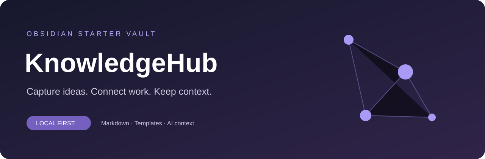

<p align="center"></p>

<p align="center">
  <a href="https://github.com/Chunwol/obsidian-knowledgehub-starter/releases/latest"></a>
  
  
  <a href="LICENSE"></a>
</p>

# 내 기록으로 시작하는 KnowledgeHub

메모, 프로젝트, 작업 결과와 결정 이유를 한곳에 연결하는 **한국어 Obsidian 스타터**입니다.
빈 프로필과 예시 노트로 시작하고, AI가 필요한 맥락을 찾아 읽도록 안내할 수 있습니다.

| 생각을 모으기 | 일을 이어가기 | 맥락을 전달하기 |
| :--- | :--- | :--- |
| Inbox와 하루 기록 | 프로젝트·세션·결정 템플릿 | AI 시작 지침과 공유용 내보내기 |
| 먼저 적고 나중에 분류 | 결과와 근거를 함께 기록 | 사용자가 고른 노트만 직접 첨부 |

## 3단계로 시작하기

### 1. 다운로드

[최신 Release](https://github.com/Chunwol/obsidian-knowledgehub-starter/releases/latest)에서 `knowledgehub-starter-v1.0.0.zip`을 받아 **전체 압축을 풉니다**.
또는 상단 **Use this template**으로 자기 저장소를 만든 뒤 복제합니다.

### 2. 자동 세팅

Windows PowerShell에서 압축을 푼 폴더로 이동하고 실행하세요.

```powershell
powershell -NoProfile -ExecutionPolicy Bypass -File .\setup.ps1
```

저장 경로와 표시 이름을 입력하면 새 보관함이 만들어집니다. 기본 경로는 Documents의 KnowledgeHub입니다.
경로를 직접 지정할 수도 있습니다.

```powershell
.\setup.ps1 -Destination "D:\Notes\My KnowledgeHub" -Name "사용자"
```

현재 실행에만 실행 정책을 적용하며 시스템 정책을 바꾸지 않습니다. **비어 있지 않은 대상 폴더에는 설치하지 않습니다.**

### 3. 옵시디언에서 열기

[Obsidian 설치](https://obsidian.md/download) → **Open folder as vault** → 생성한 폴더 선택 → `홈.md` 열기.
`나의 프로필`을 채우고 `예시 프로젝트`를 참고해서 첫 프로젝트를 만드세요.

> macOS·Linux에서도 `vault` 폴더를 원하는 위치로 복사하고 보관함으로 열 수 있습니다. 프로필의 `{{DISPLAY_NAME}}`은 직접 바꾸세요. 자동 세팅은 Windows용입니다.

## 어떤 모습으로 쓰나요?

```text
빠른 메모 → 프로젝트 → 작업 세션 → 결정 기록
                 ↑          │
                 └── 다음 작업에서 이어 읽기
```

예를 들어 책을 읽는 프로젝트라면 목표를 프로젝트에 적고, 하루 독서 결과는 세션에 남깁니다.
방식을 바꾼 이유는 결정 노트로 연결합니다. AI에는 해당 프로젝트와 관련 기록만 읽도록 안내합니다.

## 폴더 구조

```text
KnowledgeHub/
├── 홈.md / AI_START.md
├── 00_Inbox/          빠른 메모
├── 10_Projects/       진행하는 프로젝트
├── 20_Areas/          프로필과 관리 영역
├── 30_Resources/      참고 자료
├── 40_Archive/        마무리된 자료
├── 50_Daily/          일일 기록
├── 60_Sessions/       작업 결과와 근거
├── 65_Conversations/  직접 보관하는 대화
├── 70_Decisions/      선택과 이유
├── 80_Templates/      6종 문서 템플릿
├── 90_System/         안내·Bases·Python 도구
└── 99_Attachments/    이미지와 PDF
```

## AI 연결

설치 후 생성되는 `AI-INSTRUCTIONS.txt`를 사용 중인 로컬 AI 도구의 작업 지침에 추가하세요.
기존 `AGENTS.md`나 `CLAUDE.md`는 자동으로 수정하지 않습니다.
파일 접근이 가능한 도구는 `AI_START.md` → 관련 프로젝트 → 세션·결정 → 실제 소스 순서로 읽게 됩니다.

일반 채팅에서는 아래 도구로 만든 맥락 파일을 직접 검토하고 첨부하세요.
보관함을 만든 것만으로 AI에 자동 연결되거나 다른 채팅에 기억이 전달되지는 않습니다.

## 검색 · 맥락 내보내기 · 백업

선택 기능입니다. [Python 3.10 이상](https://www.python.org/downloads/)만 있으면 추가 패키지 없이 실행할 수 있습니다.
보관함 폴더에서 실행하세요.

```powershell
python 90_System/tools/knowledge.py search "예시"
python 90_System/tools/knowledge.py export
python 90_System/tools/knowledge.py backup --output "../knowledgehub-backup.zip"
```

내보내기는 `privacy: shareable`인 노트만 포함합니다. 기본 프로필과 새 템플릿은 `private`입니다.
검색은 로컬 문자열 검색입니다. 백업은 **비공개 노트까지 포함한 전체 ZIP**이므로 개인적으로 보관하세요.

## 플러그인

기본 기능만으로 시작할 수 있습니다. 홈 자동 열기, 관련 노트 제안, 표 편집은 [선택 플러그인 안내](docs/plugins.md)를 참고하세요.
커뮤니티 플러그인 설치와 활성화, 계정·모델 설정은 사용자가 직접 합니다.

## 문제 해결

| 상황 | 해결 |
| --- | --- |
| 대상 폴더가 비어 있지 않음 | 새 폴더 경로를 지정하세요. 기존 파일은 덮어쓰지 않습니다. |
| 스크립트를 찾지 못함 | ZIP 전체를 풀고 `setup.ps1`이 있는 폴더에서 실행하세요. |
| python 명령을 찾지 못함 | Python을 설치하거나 Windows에서 `py`로 실행하세요. |
| 프로젝트 표가 나오지 않음 | 최신 Obsidian에서 Core plugins의 Bases를 활성화하세요. |
| 템플릿 명령이 없음 | Core plugins의 Templates를 활성화하세요. |
| AI가 보관함을 못 읽음 | 해당 도구의 경로와 파일 접근 권한을 확인하세요. |

## 개발과 검증

Python 3.10 이상과 PowerShell 7(`pwsh`)이 있는 Windows에서:

```powershell
python -m unittest discover -s tests -v
```

한글·공백 경로 설치, 특수문자 이름, 기존 폴더 보호, 비공개 노트 제외, 검색·백업을 실제 실행합니다.
자동 설치 호환성: Windows PowerShell 5.1 / PowerShell 7. 옵시디언 GUI에서의 렌더링은 별도 확인 대상입니다.

스타터의 MIT 라이선스는 Obsidian 앱과 외부 플러그인의 라이선스를 대신하지 않습니다.
